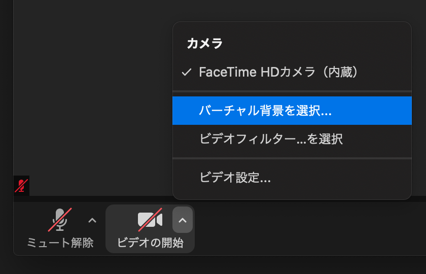

# ビデオ会議用背景画像

Web×IoT メイカーズチャレンジのビデオ会議用バーチャル背景画像です。設定方法はこのページの下をご覧ください。

## Zoom の設定方法

1. 上にある画像の中から好きなものを右クリックし、「名前を付けて画像を保存」を選択します。 
2. デスクトップなど分かりやすい場所に画像を保存します。
3. Zoom のミーティング画面を開きます。
4. 画面左下「ビデオの開始」ボタンの横にある「^」をクリックし、「バーチャル背景を選択」を選択します。 
5. 設定画面が表示されたら、右端にある「+」ボタンをクリックし、「画像を追加」を選択します。 
6. 先ほど保存した画像を選択します。
7. 設定画面を閉じてミーティングに戻ります。
